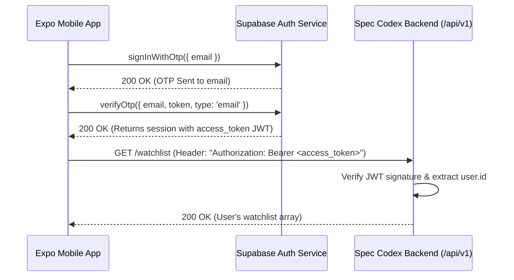

# Spec Codex — Mobile API Contract (Expo Handoff)

> **Document Version**: 1.0.0  
> **Target Audience**: Mobile Engineering (React Native / Expo SDK 52+)  
> **API Protocol**: REST + Server-Sent Events (SSE) + JSON  
> **OpenAPI 3.0 Specification**: `GET /api/v1/openapi.json`

---

## 1. Environment Base URLs

| Environment | Base URL | Notes |
| :--- | :--- | :--- |
| **Local Development (Physical Device / LAN)** | `http://<YOUR_LAN_IP>:5000/api/v1` | Ensure Expo device and dev PC are on the same Wi-Fi subnet |
| **Local Development (Android Emulator)** | `http://10.0.2.2:5000/api/v1` | Standard Android loopback address |
| **Local Development (iOS Simulator)** | `http://localhost:5000/api/v1` | Direct localhost mapping on macOS |
| **Production** | `https://specpedia-api.onrender.com/api/v1` | Managed deployment with SSL termination |

---

## 2. Authentication Flow (Supabase OTP → Bearer JWT)

Spec Codex uses passwordless OTP authentication powered by Supabase.

### Flow Architecture



### Authorization Header
For all protected endpoints (`/watchlist` routes):
```http
Authorization: Bearer <SUPABASE_ACCESS_TOKEN>
```
If missing, expired, or invalid, the backend returns:
```json
{
  "error": "Unauthorized"
}
```
HTTP Status Code: `401 Unauthorized`.

---

## 3. Standard Error Envelope & Headers

All non-2xx responses conform to a uniform JSON error envelope:

```json
{
  "error": "Human-readable description of error",
  "details": [ /* Optional Zod validation issues or metadata */ ]
}
```

### Common HTTP Status Codes
- `200 OK`: Request succeeded.
- `400 Bad Request`: Payload validation failed against Zod schema (check `details`).
- `401 Unauthorized`: Missing or invalid Bearer token.
- `404 Not Found`: Resource (e.g. item ID) does not exist.
- `429 Too Many Requests`: Rate limit reached.
- `500 Internal Server Error`: Unhandled server exception.

### Rate Limit Headers
Applied to `/api/v1/ai/*` routes (10 requests per minute per IP):
- `RateLimit-Limit`: Maximum requests permitted within window (`10`).
- `RateLimit-Remaining`: Number of requests remaining in current window.
- `RateLimit-Reset`: Number of seconds until current window resets.

---

## 4. Endpoints Reference Table

| Method | Endpoint | Auth Required | Description |
| :--- | :--- | :---: | :--- |
| `GET` | `/healthz` | No | System health check, DB latency status, and AI cache size |
| `GET` | `/openapi.json` | No | Full OpenAPI 3.0 document |
| `GET` | `/items` | No | Filterable catalog items list with explainable Codex score |
| `GET` | `/items/brands` | No | Distinct brands with device counts |
| `GET` | `/items/:id` | No | Single device specification + detailed Codex score |
| `GET` | `/items/:id/history` | No | 12-week chronological price points |
| `POST` | `/ai/chat` | No | Synchronous AI consultation (Oracle) |
| `POST` | `/ai/chat/stream` | No | Real-time streaming AI consultation via Server-Sent Events |
| `POST` | `/ai/recommend` | No | Top 3 device recommendations based on budget & priorities |
| `POST` | `/ai/explain` | No | 1-line layman explanation of technical specifications (cached 7d) |
| `GET` | `/watchlist` | **Yes** | Get authenticated user's bookmarked devices & price alerts |
| `POST` | `/watchlist` | **Yes** | Add or update device in user's watchlist with optional target price |
| `DELETE` | `/watchlist/:itemId` | **Yes** | Remove device from user's watchlist |

---

## 5. Request & Response Payloads

### 5.1 System Health (`GET /healthz`)
**Response `200 OK`**:
```json
{
  "status": "ok",
  "uptime": 142.85,
  "db": "ok",
  "cacheSize": 12
}
```
*(Note: If DB ping fails or times out after 3000ms, `db` will be `"degraded"`)*

---

### 5.2 Catalog Listing (`GET /items`)
**Query Parameters**:
- `brand` (string, optional): Filter by brand, e.g. `Samsung`, `Apple`.
- `category` (number, optional): Category ID (e.g. `1` for Mobiles).
- `search` (string, optional): Full-text query on name, brand, description.
- `limit` (number, optional, default: `100`, max: `500`).
- `offset` (number, optional, default: `0`).

**Response `200 OK`**:
```json
[
  {
    "id": 159,
    "name": "OnePlus 12",
    "brand": "OnePlus",
    "price": 64999,
    "currency": "INR",
    "slug": "oneplus-12",
    "category_id": 1,
    "specs": {
      "soc": "Snapdragon 8 Gen 3",
      "ram": "12GB",
      "storage": "256GB",
      "battery": "5400 mAh",
      "charging": "100W SuperVOOC",
      "display": "6.82\" 120Hz 2K LTPO AMOLED",
      "camera": "50MP (Sony LYT-808) + 64MP 3x Periscope + 48MP Ultrawide"
    },
    "status": "active",
    "last_verified_at": "2026-09-11T12:00:00.000Z",
    "codexScore": {
      "score": 86,
      "breakdown": [
        {
          "label": "Battery",
          "points": 28,
          "max": 30,
          "note": "5400 mAh high-end battery capacity"
        },
        {
          "label": "Silicon",
          "points": 36,
          "max": 40,
          "note": "Tier 1 flagship processor: Snapdragon 8 Gen 3"
        },
        {
          "label": "Display",
          "points": 28,
          "max": 30,
          "note": "120Hz LTPO AMOLED panel"
        }
      ]
    }
  }
]
```

---

### 5.3 Brand Registry (`GET /items/brands`)
**Response `200 OK`**:
```json
[
  { "name": "Apple", "brand": "Apple", "count": 18 },
  { "name": "Samsung", "brand": "Samsung", "count": 24 },
  { "name": "OnePlus", "brand": "OnePlus", "count": 12 },
  { "name": "Xiaomi", "brand": "Xiaomi", "count": 16 },
  { "name": "Google", "brand": "Google", "count": 8 }
]
```

---

### 5.4 Item Price History (`GET /items/:id/history`)
**Response `200 OK`**:
```json
[
  { "id": 1, "item_id": 159, "price": 69999, "recorded_at": "2026-06-20T12:00:00.000Z" },
  { "id": 2, "item_id": 159, "price": 67999, "recorded_at": "2026-06-27T12:00:00.000Z" },
  { "id": 12, "item_id": 159, "price": 64999, "recorded_at": "2026-09-11T12:00:00.000Z" }
]
```

---

### 5.5 AI Recommendations (`POST /ai/recommend`)
**Request Body**:
```json
{
  "budget": 30000,
  "priorities": ["camera", "battery"],
  "freeText": "Looking for clean software and great low-light photos"
}
```

**Response `200 OK`**:
```json
{
  "picks": [
    {
      "id": 104,
      "name": "Google Pixel 8a",
      "brand": "Google",
      "price": 31999,
      "specs": { "camera": "64MP + 13MP", "soc": "Tensor G3" },
      "reason": "Exceptional computational photography and portrait color accuracy in this budget tier."
    }
  ],
  "reasoning": "Under ₹35,000, Pixel 8a offers the best camera image pipeline, accompanied by steady battery life."
}
```

---

### 5.6 Specification Inscription Layman Explain (`POST /ai/explain`)
**Request Body**:
```json
{
  "key": "charging",
  "value": "100W SuperVOOC"
}
```

**Response `200 OK`**:
```json
{
  "explanation": "Ultra-fast wired charging that can charge the entire battery from 0% to 100% in approximately 26 minutes.",
  "cached": true
}
```

---

### 5.7 User Watchlist (`GET /watchlist` & `POST /watchlist`)

#### GET `/watchlist`
**Response `200 OK`**:
```json
[
  {
    "userId": "3e46ec60-5f21-4f95-924b-324c0847fcf6",
    "itemId": 159,
    "targetPrice": 60000,
    "notifiedAt": null,
    "createdAt": "2026-09-11T14:30:00.000Z",
    "name": "OnePlus 12",
    "brand": "OnePlus",
    "price": 64999
  }
]
```

#### POST `/watchlist`
**Request Body**:
```json
{
  "itemId": 159,
  "targetPrice": 60000
}
```
**Response `200 OK`**:
```json
{
  "success": true,
  "data": {
    "user_id": "3e46ec60-5f21-4f95-924b-324c0847fcf6",
    "item_id": 159,
    "target_price": 60000
  }
}
```

---

## 6. Real-Time Streaming SSE Protocol (`POST /ai/chat/stream`)

For Oracle Chat responses in mobile, use `fetch` with `ReadableStream` or an SSE client (e.g. `react-native-sse` or `expo-fetch`).

### Request
```http
POST /api/v1/ai/chat/stream HTTP/1.1
Content-Type: application/json
Accept: text/event-stream

{
  "message": "Compare Snapdragon 8 Gen 3 vs A18 Pro for battery efficiency",
  "history": [
    { "role": "user", "content": "Hello" },
    { "role": "assistant", "content": "Greetings, seeker." }
  ]
}
```

### Event Stream Chunks
Chunks are emitted using standard SSE formatting:
```
data: {"token":"The "}

data: {"token":"Snapdragon "}

data: {"token":"8 "}

data: {"token":"Gen 3..."}

data: [DONE]
```

If an unrecoverable model error occurs mid-stream:
```
data: {"error":"stream_failed"}
```

### Expo Consumption Example (TypeScript)
```typescript
async function streamOracleAdvice(prompt: string, onChunk: (text: string) => void) {
  const response = await fetch(`${API_BASE_URL}/ai/chat/stream`, {
    method: 'POST',
    headers: { 'Content-Type': 'application/json' },
    body: JSON.stringify({ message: prompt }),
  });

  const reader = response.body?.getReader();
  const decoder = new TextDecoder();
  let buffer = '';

  while (reader) {
    const { done, value } = await reader.read();
    if (done) break;

    buffer += decoder.decode(value, { stream: true });
    const lines = buffer.split('\n\n');
    buffer = lines.pop() || '';

    for (const block of lines) {
      const line = block.trim();
      if (!line.startsWith('data: ')) continue;
      const dataStr = line.replace('data: ', '').trim();
      if (dataStr === '[DONE]') return;

      try {
        const payload = JSON.parse(dataStr);
        if (payload.token) onChunk(payload.token);
      } catch (e) {
        console.warn('Failed to parse SSE payload chunk', e);
      }
    }
  }
}
```

---

## 7. Mobile UI Design Token Alignment

When styling Expo components, align with the Spec Codex tokens:

| Token Name | Parchment (Default) | Midnight (Dark) |
| :--- | :--- | :--- |
| `color-primary` (Wax Red) | `#7A3E2C` | `#C86D51` |
| `color-primary-dark` | `#5A2C1F` | `#3A1910` |
| `color-accent` (Manuscript Gold) | `#C9A227` | `#F1C40F` |
| `color-bg-primary` (Base Paper) | `#F9F6F0` | `#1A1614` |
| `color-bg-surface` | `#FFFDF9` | `#241E1B` |
| `color-text-primary` | `#2C2420` | `#F4EFEA` |
| `font-heading` | Cinzel (Serif) | Cinzel (Serif) |
| `font-mono` | JetBrains Mono | JetBrains Mono |

---
*Signed & Sealed for the Spec Codex Mobile Engineering Core, MMXXV.*
